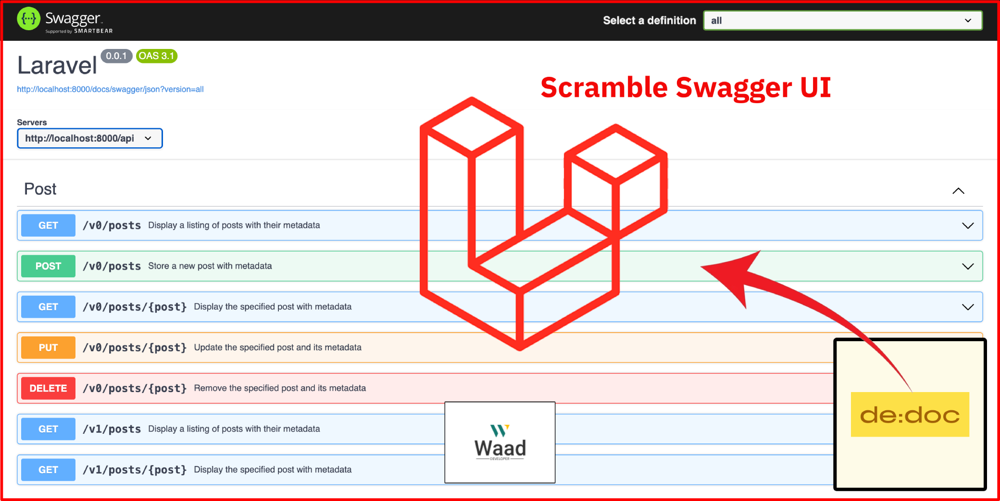

# Scramble Swagger for Laravel



A Laravel package that seamlessly integrates with [Dedoc Scramble](https://github.com/dedoc/scramble) to automatically generate Swagger/OpenAPI documentation for your APIs and support multiple versions of your API. No manual documentation required - your API endpoints are documented based on your route definitions and code.

> :warning: This package depends on [Dedoc Scramble](https://github.com/dedoc/scramble).

## Requirements

- Laravel 10.x or higher
- PHP 8.1 or higher

## Installation

```bash
composer require waad/scramble-swagger
```
```bash
php artisan vendor:publish --provider "Waad\ScrambleSwagger\ScrambleSwaggerServiceProvider"
```

## Usage

1. Configure the `config/scramble.php` and `config/scramble-swagger.php` files.
2. Open URL Swagger documentation `/docs/swagger` depend on `scramble-swagger.url`.


## Main Features

- All Features of [Dedoc Scramble](https://github.com/dedoc/scramble).
- Support multiple versions of your API.
- Use Swagger UI v5.18.3
- Use OAS 3.1.0

## License

Package is open-source software licensed under the [MIT license](LICENSE.md).


